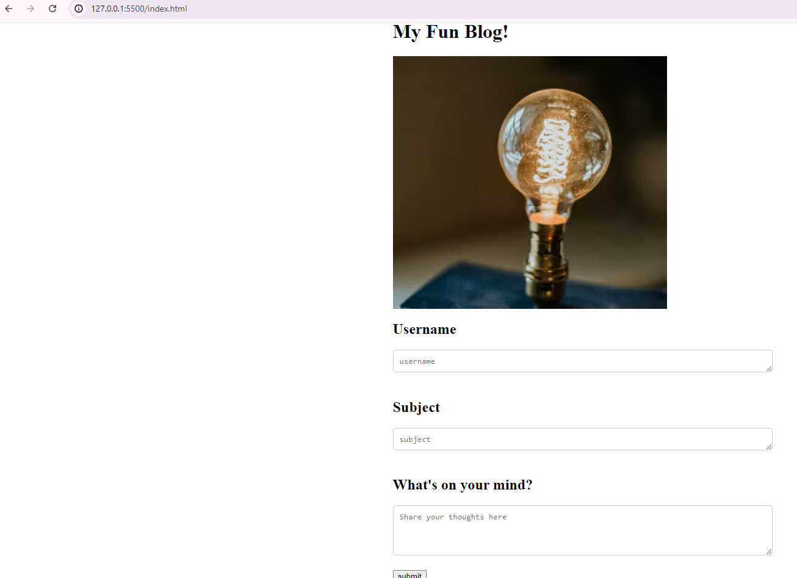

# My-Fun-Blog

## Description

I made a two-page blog where users can input and view their blog posts. It includes a content form, dynamically rendering blog posts, and has a light/dark mode toggle. I used HTML,CSS and vanilla JavaScript. This blog is great for anyone who wants to write anything down that comes to mind. It gives you the opportunity to look at all of your previous thoughts after writing down a new one!

## Link

http://127.0.0.1:5500/index.html

## Screenshot

